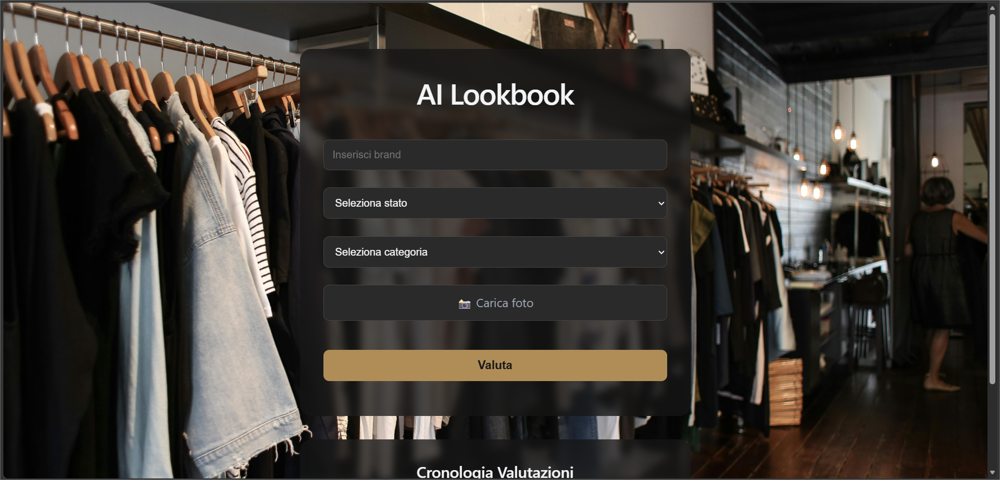
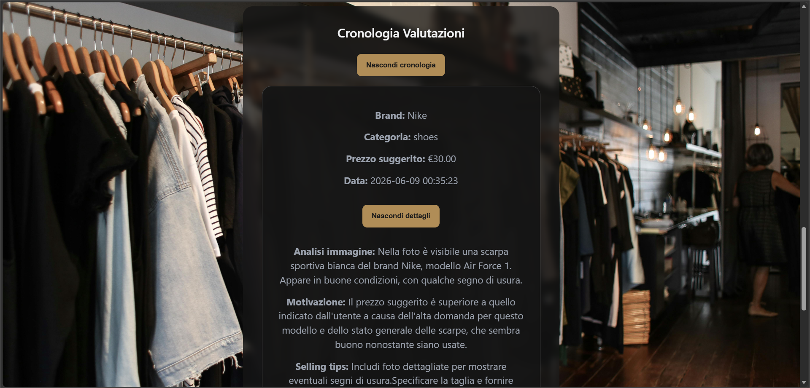

# AI Lookbook

Web application that analyzes fashion items from uploaded images and generates price estimates, selling tips, and listing descriptions using OpenAI.

## Features

- Upload an image of a fashion item
- AI-powered image analysis
- Suggested selling price
- Minimum and maximum price range
- Selling tips for online marketplaces
- Automatically generated listing description
- Evaluation history stored in MySQL
- Expand/collapse details for previous evaluations

## Screenshots

### Home



### Evaluation Result


### Evaluation History



## Technologies Used

### Frontend
- React
- Vite
- CSS3

### Backend
- PHP
- Composer
- OpenAI PHP SDK

### Database
- MySQL
- phpMyAdmin

## Project Structure

```text
backend/
├── api/
├── config/
├── uploads/

frontend/
├── src/
├── public/

ai_lookbook.sql
```

## Installation

### 1. Clone the repository

```bash
git clone <repository-url>
```

### 2. Create the database

Create a MySQL database named:

```text
ai_lookbook
```

Import:

```text
ai_lookbook.sql
```

using phpMyAdmin.

### 3. Configure environment variables

Create a `.env` file inside the backend folder and add:

```env
OPENAI_API_KEY=your_api_key
```

### 4. Install PHP dependencies

```bash
composer install
```

### 5. Install frontend dependencies

```bash
cd frontend
npm install
```

### 6. Start the frontend

```bash
npm run dev
```

### 7. Start the PHP backend

Run your PHP server (XAMPP or equivalent).

## Main Learning Objectives

This project demonstrates:

- React state management with `useState`
- Data fetching with `useEffect`
- Communication between React and PHP
- File uploads
- Database integration with PDO
- MySQL data persistence
- JSON encoding and decoding
- Dynamic UI interactions
- CSS animations and transitions
- OpenAI API integration

## Author

Mario Parisella
